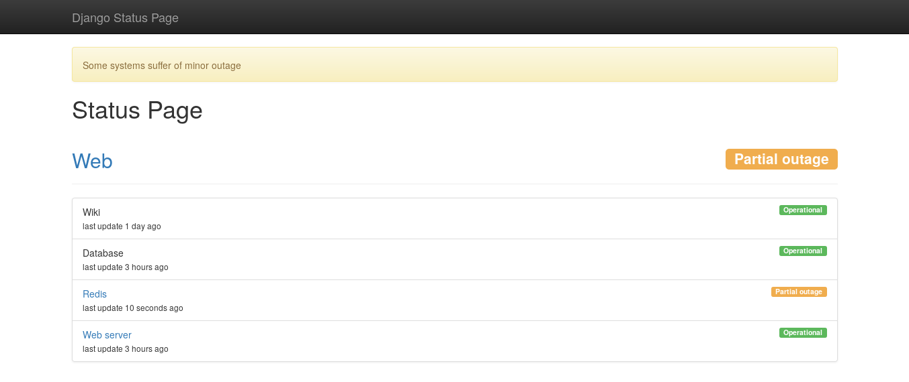

# statusboard

[](https://travis-ci.org/edigiacomo/django-statusboard)
[](https://pypi.python.org/pypi/django-statusboard/)

Status page application.




## Installation

Install the package

```sh
pip install django-statusboard
```

Add the following applications to your Django projects

```python
INSTALLED_APPS += [
    'django.contrib.humanize',
    'rest_framework',
    'statusboard',
]
```

Update your urlconf:

```python
# myproject/urls.py
urlpatterns += [
    url(r'^statusboard/$', include('statusboard.urls')),
]
```

Update your database

```sh
./manage migrate statusboard
```

## Usage

Service status can be managed from Django admin interface or using the REST
API.


## Customize pages

Blocks:

* `title`
* `branding`
* `bootstrap_theme`
* `header`
* `userlinks`
* `footer`
* `style`
* `script`

[travis]: http://travis-ci.org/edigiacomo/django-statusboard
